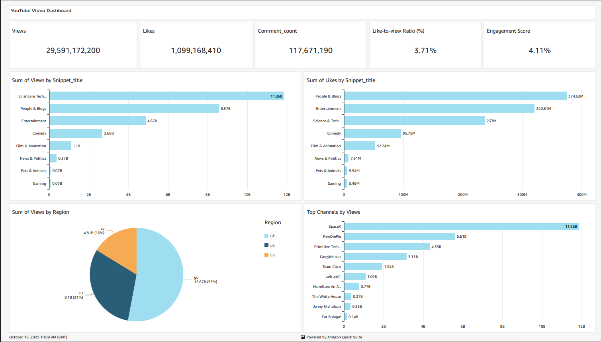

# AWS Data Pipeline for YouTube Trend Analysis

## 🚀 Project Overview

I designed and implemented an end-to-end, cloud-based data engineering pipeline on AWS to process and analyze trending YouTube video data. This project demonstrates a scalable framework for ingesting raw data, performing ETL, and enabling data visualization for key business metrics.

## 🎯 Project Objectives & Implementation

The goal was to build a fully automated, serverless pipeline that transforms raw, semi-structured YouTube data into actionable insights. Here's what I successfully built:

- **🔁 Automated Data Ingestion:** Established a mechanism to collect and store raw YouTube trending data directly into Amazon S3.
- **⚙️ ETL & Data Processing:** Automated data cleaning, transformation, and partitioning using AWS Glue with PySpark.
- **🛠️ Orchestration:** Created a reusable AWS Lambda function to trigger and manage the data preprocessing workflow.
- **📊 Data Lake & Querying:** Centralized data storage in S3 and enabled serverless SQL querying using Amazon Athena.
- **📈 Analytics & Reporting:** Built an interactive Amazon QuickSight dashboard to visualize key performance indicators (KPIs).

## 🛠️ AWS Services Used

| Service | Purpose in this Project |
| :--- | :--- |
| **Amazon S3** | Centralized data lake for storing raw and processed data. |
| **AWS IAM** | Securely managed access permissions for all AWS services. |
| **AWS Glue** | Serverless data integration and ETL (using PySpark) to clean and prepare data. |
| **AWS Lambda** | Serverless compute to orchestrate the ETL job execution. |
| **Amazon Athena** | Interactive query service to analyze data directly in S3 using SQL. |
| **Amazon QuickSight** | Business intelligence service for creating the analytics dashboard. |

## 📊 Key Analytics & Insights

The final dashboard provides clear answers to key questions by tracking these KPIs:

- **Total Views, Likes, and Comments**
- **Like-to-View Ratio (%)** - A measure of content reception.
- **Engagement Score** - A calculated proxy for video virality.
- **Top 10 Channels by Views** - Identifying the most prominent creators.

## 🗂️ Dataset

This project utilizes the [YouTube Trending Video Dataset](https://www.kaggle.com/datasets/datasnaek/youtube-new) from Kaggle. It includes daily records of trending videos with metadata such as title, channel, publish time, views, likes, dislikes, and comments.

## 💡 Learning Outcomes

This hands-on project was a comprehensive exercise in building a modern data pipeline on the cloud. Key takeaways include:

- Architecting a scalable, serverless data engineering solution on AWS.
- Writing production-style ETL scripts using PySpark in AWS Glue.
- Automating pipeline components and understanding event-driven orchestration.
- Translating raw data into clear, business-focused insights through visualization.

---

*This project was completed as a guided learning exercise, with thanks to Darshil Parmar for sharing his expertise.*

## Architecture Diagram

## Dashboard

